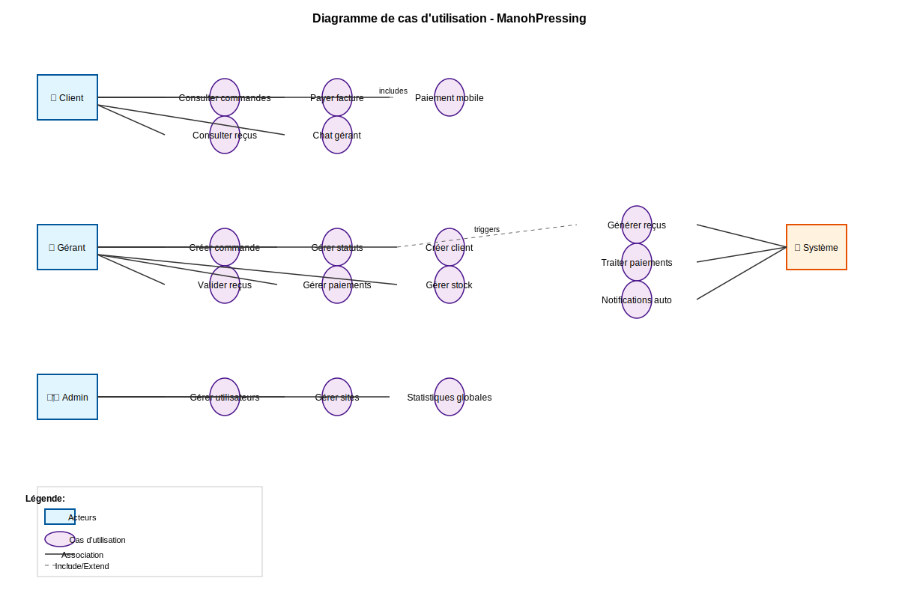
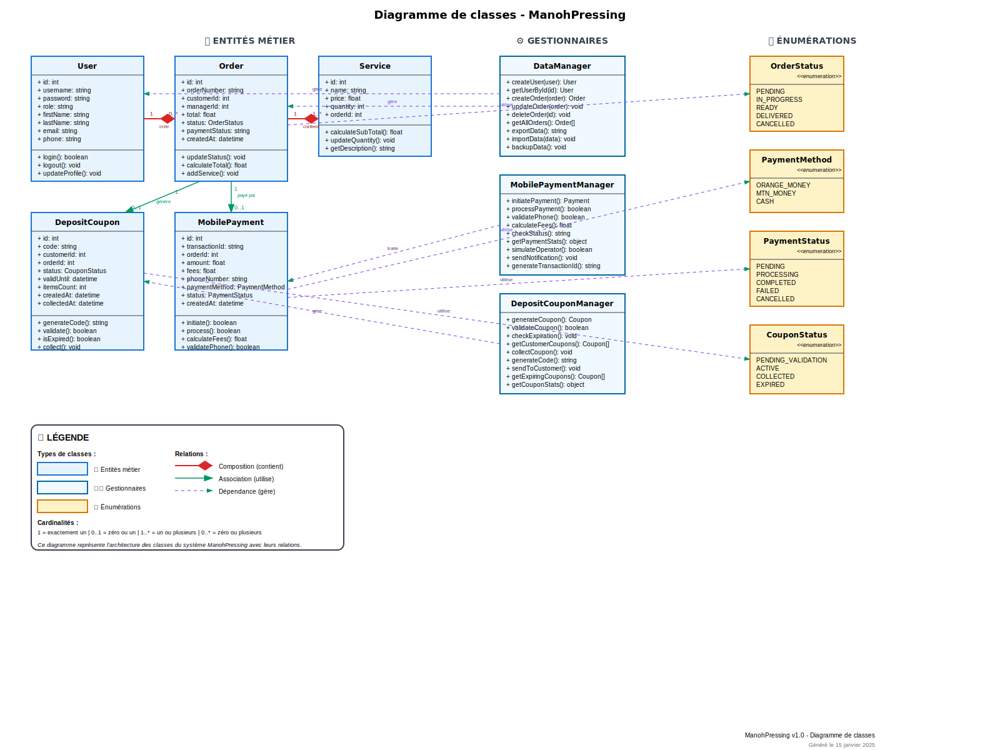
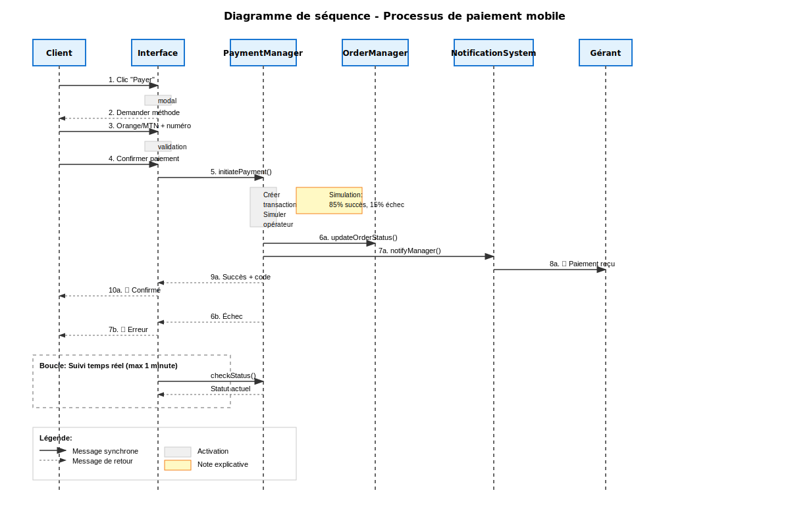
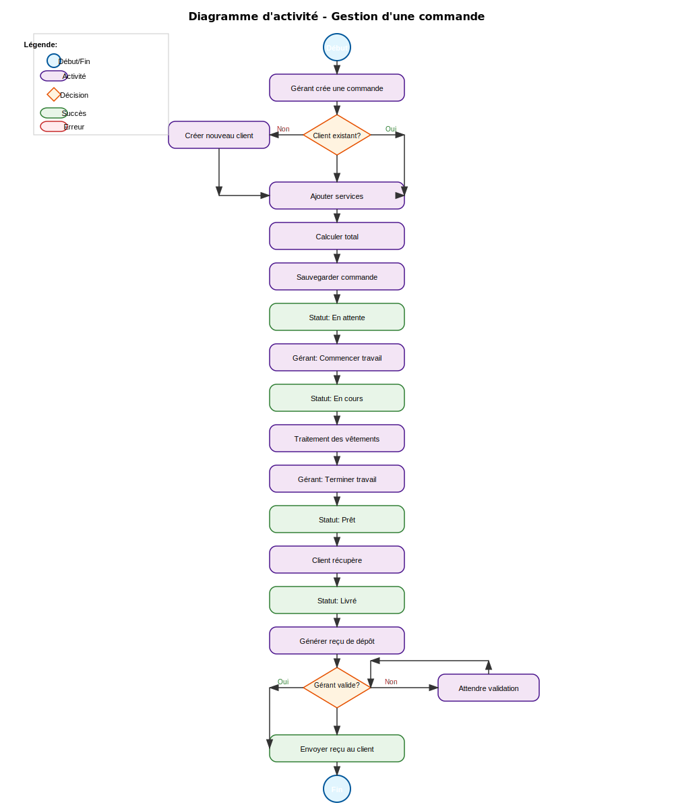

# 🧺 ManohPressing - Système de Gestion de Pressing

## 📋 Description du Projet

ManohPressing est une application web complète de gestion de pressing développée avec des technologies modernes. Elle permet la gestion des commandes, des clients, des paiements mobiles, et des reçus de dépôt avec un système de notifications en temps réel.

## ✨ Fonctionnalités Principales

### 👤 **Gestion des Utilisateurs**
- **3 rôles** : Administrateur, Gérant, Client
- **Authentification sécurisée** avec sessions
- **Profils personnalisés** pour chaque type d'utilisateur
- **Gestion multi-sites** pour les gérants

### 📦 **Gestion des Commandes**
- **Cycle complet** : En attente → En cours → Prêtes → Livrées
- **Services multiples** : Nettoyage à sec, repassage, teinture
- **Suivi en temps réel** des statuts
- **Notifications automatiques** aux clients

### 🎫 **Système de Reçus de Dépôt**
- **Génération automatique** après livraison
- **Codes uniques** de vérification (format DEP123456)
- **Validation par le gérant** avant envoi
- **Expiration automatique** après 90 jours
- **Traçabilité complète** des dépôts et retraits

### 💳 **Paiements Mobiles**
- **Orange Money** et **MTN Mobile Money**
- **Validation des numéros** par opérateur
- **Calcul automatique des frais** (2% Orange, 1.5% MTN)
- **Suivi temps réel** des transactions
- **Notifications gérant** automatiques

### 💬 **Communication**
- **Chat en temps réel** entre clients et gérants
- **Système de notifications** push
- **Messages automatiques** de changement de statut
- **Historique des conversations**

### 📊 **Gestion et Statistiques**
- **Dashboard complet** pour chaque rôle
- **Statistiques détaillées** des commandes et paiements
- **Gestion du stock** avec alertes de réapprovisionnement
- **Export des données** en différents formats

## 🏗️ Architecture du Système

### 📐 Diagrammes UML

#### 1. Diagramme de Cas d'Utilisation


**Acteurs principaux :**
- **Client** : Consulte commandes, paie factures, utilise reçus de dépôt
- **Gérant** : Gère commandes, clients, valide reçus, reçoit paiements
- **Administrateur** : Supervise le système, gère utilisateurs et sites
- **Système** : Automatise génération reçus, expiration, notifications

#### 2. Diagramme de Classes


**Classes principales :**
- **User** : Gestion des utilisateurs (admin, gérant, client)
- **Order** : Commandes avec services et statuts
- **DepositCoupon** : Reçus de dépôt avec codes de vérification
- **MobilePayment** : Paiements Orange Money et MTN Money
- **Service** : Services de pressing (nettoyage, repassage, etc.)

**Classes de gestion :**
- **DataManager** : CRUD des données principales
- **DepositCouponManager** : Gestion complète des reçus
- **MobilePaymentManager** : Traitement des paiements mobiles
- **NotificationManager** : Système de notifications

#### 3. Diagramme de Séquence - Paiement Mobile


**Processus détaillé :**
1. Client sélectionne méthode de paiement
2. Validation du numéro de téléphone
3. Calcul des frais de transaction
4. Simulation du paiement opérateur
5. Notification automatique du gérant
6. Suivi temps réel du statut

#### 4. Diagramme d'Activité - Gestion Commande


**Workflow complet :**
- Création de commande par le gérant
- Progression des statuts avec validations
- Génération automatique du reçu de dépôt
- Processus de paiement optionnel
- Notifications à chaque étape

## 🛠️ Technologies Utilisées

### Backend
- **PHP** : Langage principal
- **Architecture MVC** : Séparation des responsabilités
- **Base de données** : MySQL/PostgreSQL
- **API REST** : Communication frontend/backend

### Frontend
- **JavaScript ES6+** : Modules et classes modernes
- **CSS3** : Design responsive et animations
- **Chart.js** : Graphiques interactifs
- **FullCalendar.js** : Calendrier de livraison
- **jsPDF** : Génération de factures PDF
- **SheetJS** : Export Excel

### **Frontend**
- **HTML5** avec sémantique moderne
- **CSS3** avec variables CSS et animations
- **JavaScript ES6+** avec modules
- **Font Awesome** pour les icônes
- **Design responsive** mobile-first

### **Backend (Simulation)**
- **LocalStorage** pour la persistance
- **Modules JavaScript** pour la logique métier
- **API simulée** pour les paiements mobiles
- **Système de notifications** en temps réel

### **Architecture**
- **Pattern MVC** avec séparation des responsabilités
- **Modules réutilisables** pour chaque fonctionnalité
- **Gestionnaires spécialisés** (Payment, Coupon, Notification)
- **Design patterns** : Observer, Manager, State

## 🚀 Installation et Démarrage

### **Prérequis**
- Navigateur web moderne (Chrome, Firefox, Safari, Edge)
- Serveur web local (optionnel)

### **Installation**
```bash
# Cloner le projet
git clone [URL_DU_REPO]
cd manohpressing

# Démarrer un serveur local (optionnel)
python -m http.server 8000
# ou
npx serve .
# ou
php -S localhost:8000
```

### **Accès à l'application**
- **URL** : `http://localhost:8000`
- **Page de connexion** : Interface unique avec sélection de rôle

## 👥 Comptes de Test

### **Administrateur**
- **Username** : `admin`
- **Password** : `admin123`
- **Accès** : Gestion complète du système

### **Gérant**
- **Username** : `manager1`
- **Password** : `manager123`
- **Accès** : Gestion des commandes et clients

### **Clients**
- **Username** : `client1` / **Password** : `client123`
- **Username** : `client2` / **Password** : `client123`
- **Accès** : Consultation commandes et paiements

## 📱 Utilisation

### **Pour les Clients**
1. **Connexion** avec identifiants client
2. **Consultation** des commandes en cours
3. **Paiement** des factures via Orange/MTN Money
4. **Consultation** des reçus de dépôt
5. **Communication** avec le gérant via chat

### **Pour les Gérants**
1. **Création** de nouvelles commandes
2. **Gestion** des statuts (En attente → En cours → Prêtes → Livrées)
3. **Validation** et envoi des reçus de dépôt
4. **Réception** des notifications de paiement
5. **Gestion** des clients et du stock

### **Pour les Administrateurs**
1. **Supervision** de tous les sites
2. **Gestion** des utilisateurs et gérants
3. **Consultation** des statistiques globales
4. **Configuration** du système

## 🔧 Configuration

### **Paiements Mobiles**
```javascript
// Configuration dans mobile-payment.js
paymentMethods: {
    'orange_money': {
        fees: 0.02,        // 2% de frais
        regex: /^6[5-9]\d{7}$/,
        prefix: '+237'
    },
    'mtn_money': {
        fees: 0.015,       // 1.5% de frais
        regex: /^6[7-8]\d{7}$/,
        prefix: '+237'
    }
}
```

### **Reçus de Dépôt**
```javascript
// Configuration dans coupon-manager.js
couponTypes: {
    'deposit_receipt': {
        validityDays: 90,  // 3 mois pour récupérer
        requiresPickup: true
    }
}
```

## 📊 Données et Stockage

### **Structure des Données**
- **Users** : `manohpressing_users`
- **Orders** : `manohpressing_orders`
- **Coupons** : `manohpressing_coupons`
- **Payments** : `manohpressing_payments`
- **Stock** : `manohpressing_stock`
- **Notifications** : `manohpressing_notifications`

### **Sauvegarde des Données**
```javascript
// Export complet des données
const allData = {
    users: JSON.parse(localStorage.getItem('manohpressing_users') || '[]'),
    orders: JSON.parse(localStorage.getItem('manohpressing_orders') || '[]'),
    // ... autres données
};
```

## 🧪 Tests et Validation

Voir le fichier [TESTS.md](TESTS.md) pour les détails complets des tests et validations.

## 🤝 Contribution

1. **Fork** le projet
2. **Créer** une branche feature (`git checkout -b feature/AmazingFeature`)
3. **Commit** les changements (`git commit -m 'Add AmazingFeature'`)
4. **Push** vers la branche (`git push origin feature/AmazingFeature`)
5. **Ouvrir** une Pull Request

## 📄 Licence

Ce projet est sous licence MIT. Voir le fichier `LICENSE` pour plus de détails.

## 📞 Contact

- **Développeur** : [Votre Nom]
- **Email** : [votre.email@example.com]
- **Projet** : [Lien GitHub]

---

**ManohPressing** - *Gestion moderne de pressing avec paiements mobiles* 🧺✨